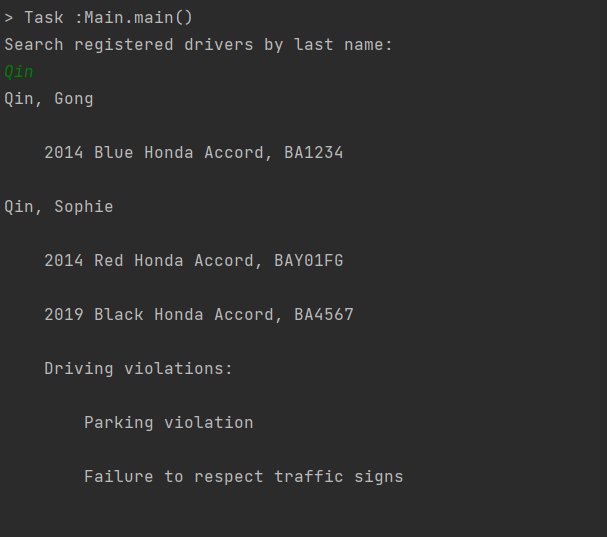
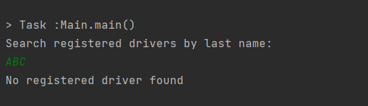
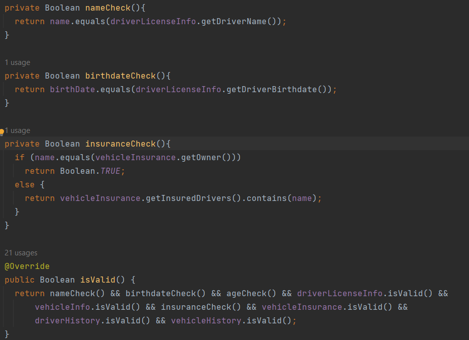

## Problem Overview 
This project is to develop a system to validate whether an application from a driver, if it is validated, the driver can register successfully. Two most important parts of an application are name and vehicle, the user is allowed to register two vehicles under one name, or one vehicle can also be under different names. The system also has search functionality, allowing users to search registered drivers' records by last names.

## Design Ideas 
I divided this project into 3 main parts: 
+ Database Parsing 
  In this project, my database is a csv file, which has a strict format restriction. In the parsing part, I utilized file I/O, and regular expression to extract data, then save them to the hashmap. The hashmap is like a stage area so that I can extract data into different classes. 
+ Driver Validation 
  I utilized a lot of subtype polymorphism in this part to make sure fields in the specific classes would be validated first, then in the Driver class I only need to collect all results from its component classes. 
+ User Interface
  User can input any last names here, the system will display driver's information in a specified format. 

## How to run my code 
Run the main method in RideshareDriverValidator class in the view folder, input any last name you want to search. 
if there are qualified drivers, the output will be like: 
  
if there doesn't exist any qualified drivers, the output will be like: 
  

**The database is the csv file in resources folder, more rows can be added, but should follow the strict format, for example, if there is no violation record, you still need to put "violations:" in the cell, which is the key of hashmap.** 

## Key challenges 
1. The parsing process is very complicated, I found that hashmap worked very great here. It provides an efficient way to store and retrieve key-value pairs, which can significantly speed up the lookup process, especially when dealing with large files, and also associate values with fields in different classes quickly. 
2. There were too many validation conditions. Therefore I utilized polymorphism, createed a unified interface for various validation strategies, which improved code reusability and maintainability.The biggest advantage is that it simplifed conditional logic, Now in the Driver class, I can use results from other classes' validations. 
Here is my core code for validation:  

  

## Resources  
I used csv file parsing code from group assignment hw8, this code is contributed by both my teammate and me. 
I also learned lambda functions from lecture slides and stack overflow. 
I learned fuctory design pattern from https://www.runoob.com/design-pattern/factory-pattern.html. 

## Answers to Questions 
1. Please include a code snippet showing how have you used inheritance and 
composition in your code. 
inheritance: 
```java   
/**
 * Abstract class for all incidents, including moving, non-moving violations
 * and crashes
 */
public abstract class Incident {
  protected LocalDate date;
  protected String incident;
  protected Name name;
  /**
   * Constructor for Incident
   * @param date the date incident happened
   * @param incident specific incident type
   * @param name the name of offending driver
   */  
  public Incident(LocalDate date, String incident, Name name) {
    this.date = date;
    this.incident = incident;
    this.name = name;
  }
    /**
   * Constructor for Incident
   * @param date the date incidents happened
   * @param incident specific incident type
   */
  public Incident(LocalDate date, String incident) {
    this.date = date;
    this.incident = incident;
  }
 
   /**
   * Nested class for moving violations
   */
  static class MovingViolation extends Incident {

    public MovingViolation(LocalDate date, String incident, Name name) {
      super(date, incident, name);

    }

    public MovingViolation(LocalDate date, String incident) {
      super(date, incident);
    }
  }
  
  /**
   * Nested class for non-moving violations
   */
  static class NonMovingViolation extends Incident{

    public NonMovingViolation(LocalDate date, String incident, Name name) {
      super(date, incident, name);
    }

    public NonMovingViolation(LocalDate date, String incident) {
      super(date, incident);
    }
  }

  static class Crash extends Incident{
    public Crash(LocalDate date, String incident, Name name) {
      super(date, incident, name);
    }
  }
}
``` 
composition: 
```java  
public class DriverInfo implements IValid{
  private Name name;
  private LocalDate birthDate;
  private DriverLicenseInfo driverLicenseInfo;
  private VehicleInfo vehicleInfo;
  private VehicleInsurance vehicleInsurance;
  private DriverHistory driverHistory;
  private VehicleHistory vehicleHistory;
  private boolean drive;
 private static final int DEFAULT_AGE = 21;

  public DriverInfo(Name name, LocalDate birthDate, DriverLicenseInfo driverLicenseInfo,
      VehicleInfo vehicleInfo, VehicleInsurance vehicleInsurance, DriverHistory driverHistory,
      VehicleHistory vehicleHistory) {
    this.name = name;
    this.birthDate = birthDate;
    this.driverLicenseInfo = driverLicenseInfo;
    this.vehicleInfo = vehicleInfo;
    this.vehicleInsurance = vehicleInsurance;
    this.driverHistory = driverHistory;
    this.vehicleHistory = vehicleHistory;
    this.drive = vehicleInfo.getDrive();
  } 
}
``` 
2. Please include a code snippet showing how have you used an interface or an abstract class in your code. 
```java  
  static class VehicleExtractor extends Extractor implements IExtractor<VehicleInfo> {
    private static final String YEAR = "year";
    private static final String COLOR = "color";
    private static final String MAKE = "make";
    private static final String MODEL = "model";
    private static final String UID = "unique_number";
    private static final String OWNER = "owner";

    @Override
    public VehicleInfo extract(FieldMap map) {
      int year = Integer.parseInt(map.getMap().get(YEAR).trim());
      String color = map.getMap().get(COLOR).trim();
      String make = map.getMap().get(MAKE).trim();
      String model = map.getMap().get(MODEL).trim();
      String uid = map.getMap().get(UID).trim();
      Name owner =  nameSplit(map.getMap().get(OWNER));
      return new VehicleInfo(year,color,make,model,uid,owner);
    }
  }
``` 
3. Please include code example of a method overriding and method overloading from your code, or explain why you have not used any overloading or overriding.  
overloading:
``` java 
  /**
   * Constructor for Incident
   * @param date the date incident happened
   * @param incident specific incident type
   * @param name the name of offending driver
   */
  public Incident(LocalDate date, String incident, Name name) {
    this.date = date;
    this.incident = incident;
    this.name = name;
  }

  /**
   * Constructor for Incident
   * @param date the date incidents happened
   * @param incident specific incident type
   */
  public Incident(LocalDate date, String incident) {
    this.date = date;
    this.incident = incident;
  }

``` 
Overriding 
```java  
  @Override
  public Boolean isValid() {
    return nameCheck() && birthdateCheck() && ageCheck() && driverLicenseInfo.isValid() &&
        vehicleInfo.isValid() && insuranceCheck() && vehicleInsurance.isValid() &&
        driverHistory.isValid() && vehicleHistory.isValid();
  }

  @Override
  public boolean equals(Object o) {
    if (this == o) {
      return true;
    }
    if (o == null || getClass() != o.getClass()) {
      return false;
    }
    DriverInfo that = (DriverInfo) o;
    return Objects.equals(name, that.name) && Objects.equals(vehicleInfo,
        that.vehicleInfo);
  }
``` 
4. Please include a code example showing how have you used encapsulation, or explain why you did not need encapsulation in your code. 
```java  
  /**
   * Class to construct VehicleInsurance class
   */
  static class VehicleInsuranceExtractor extends Extractor implements IExtractor<VehicleInsurance> {
    private static final String OWNER = "owner";
    private static final String INSURED_DRIVERS = "insured_drivers";
    private static final String EXPIRATION_DATE = "expiration_date";
    @Override
    public VehicleInsurance extract(FieldMap map) {
      Name owner =  nameSplit(map.getMap().get(OWNER).trim());
      Set<Name> insuredDrivers = nameListSplit(map.getMap().get(INSURED_DRIVERS));
      LocalDate expirationDate = dateConverter(map.getMap().get(EXPIRATION_DATE),normalPattern);
      return new VehicleInsurance(owner,insuredDrivers,expirationDate);
    }
  }
``` 
5. Please include a code example of subtype polymorphism from your code, or explain why you did not need subtype polymorphism. 
```java  
  /**
   * Class to construct DriverHistory class
   */
  static class DriverHistoryExtractor extends Extractor implements IExtractor<DriverHistory> {
    private static final String VIOLATION = "violations";
    @Override
    public DriverHistory extract(FieldMap map) {
      Set<Incident> violations = violationListSplit(map.getMap().get(VIOLATION));
      return new DriverHistory(violations);
    }
  }
``` 
6. Please include a code snippet of generics from your code 
```java  
  /**
   * Helper method to split incidents or names list and save converted classes to Set
   * @param elements elements list
   * @param mapper a mapper to convert each string element to corresponding classes
   * @return a Set
   * @param <T> a class strings are converted to
   */
  private <T> Set<T> splitElements(String elements, Function<String, T> mapper) {
    if (elements != null && !elements.trim().isEmpty()) {
      String[] incidentListPair = elements.split(";");
      return Stream.of(incidentListPair).map(mapper).collect(Collectors.toSet());
    } else {
      return null;
    }
  }
``` 
7. Please include a code snippet showing how have you used some of the built-in data collections from the Java Collections Framework, or explain why you had no need for any data collections. 
```java  
  /**
   * Add values to csv maps
   * @param csvKey keys (csv headers)
   * @param csvMap hashmaps (for each csv cell)
   * @return hashmaps (for each csv cell)
   * @throws IllegalArgumentException throws when a key cannot be found in the csv
   */
  public Map<String, String> addFieldMap(String csvKey, Map<String, String> csvMap) throws
      IllegalArgumentException {
    Map<String, String> map = new HashMap<>();
    String input = csvMap.getOrDefault(csvKey, null);
    if (input == null)
      throw new IllegalArgumentException("Cannot find the valid key in csvMap!");
    String[] pairs = input.split("\\|");
    for (String pair : pairs) {
      String[] keyValue = pair.split(":");
      if (keyValue.length == 2) {
        String key = keyValue[0].trim();
        String value = keyValue[1].trim();
        map.put(key, value);
      } else {
        map.put(csvKey, csvMap.getOrDefault(csvKey, null));
      }
    }
    return map;
  }
``` 
8. Please include a code snippet showing how have you used interfaces Iterable and Iterator, or explain why you had no need for these two interfaces.  
```java   
  /**
   * Create hashmaps from string lists
   * @param keys List<String> to store keys
   * @param values List<String> to store values
   * @return Map<String, String>
   */
  public static Map<String, String> addMap(List<String> keys, List<String> values) {
    Map<String, String> map = new HashMap<>();
    Iterator<String> kIterator = keys.iterator();
    Iterator<String> vIterator = values.iterator();
    while (kIterator.hasNext() && vIterator.hasNext()) {
      map.put(kIterator.next(), vIterator.next());
    }
    return map;
  }
``` 
9. Please include a code snippet showing how have you used interfaces Comparable and Comparator, or explain why you had no need for these two interfaces. 
  These interfaces are used for sorting and comparing objects in Java. I didn't have need for sorting and comparing in this project.  

10. Please include a code snippet showing how have you used regular expressions, or explain why you had no need for it.
```java  
  /**
   * extract values from a violation string to construct Crash class
   * @param incident an incident string
   * @return a Crash class
   */
  private Incident crashSplit(String incident){
    String[] incidentPair = incident.split("/");
 if (incidentPair.length == 3) {
      LocalDate date = dateConverter(incidentPair[0].trim(),normalPattern);
      Name name = nameSplit(incidentPair[2].trim());
      return Incident.validateCrash(date,incidentPair[1].trim(),name);
    } else {
      return null;
    }
  }
``` 
11. Please include a code snippet showing how have you used nested classes, or justify why you had no need for nested classes.
```java  
/**
 * Abstract class for all incidents, including moving, non-moving violations
 * and crashes
 */
public abstract class Incident {
  protected LocalDate date;
  protected String incident;
  protected Name name;
  /**
   * Constructor for Incident
   * @param date the date incident happened
   * @param incident specific incident type
   * @param name the name of offending driver
   */  
  public Incident(LocalDate date, String incident, Name name) {
    this.date = date;
    this.incident = incident;
    this.name = name;
  }
    /**
   * Constructor for Incident
   * @param date the date incidents happened
   * @param incident specific incident type
   */
  public Incident(LocalDate date, String incident) {
    this.date = date;
    this.incident = incident;
  }
 
   /**
   * Nested class for moving violations
   */
  static class MovingViolation extends Incident {

    public MovingViolation(LocalDate date, String incident, Name name) {
      super(date, incident, name);

    }

    public MovingViolation(LocalDate date, String incident) {
      super(date, incident);
    }
  }
  
  /**
   * Nested class for non-moving violations
   */
  static class NonMovingViolation extends Incident{

    public NonMovingViolation(LocalDate date, String incident, Name name) {
      super(date, incident, name);
    }

    public NonMovingViolation(LocalDate date, String incident) {
      super(date, incident);
    }
  }

  static class Crash extends Incident{
    public Crash(LocalDate date, String incident, Name name) {
      super(date, incident, name);
    }
  }
}
``` 
12. Please include code example showing how have you used components of functional programming, such as lambdas and streams, or explain why you had no need for it in your code.   
```java 
  /**
   * Helper method to split incidents or names list and save converted classes to Set
   * @param elements elements list
   * @param mapper a mapper to convert each string element to corresponding classes
   * @return a Set
   * @param <T> a class strings are converted to
   */
  private <T> Set<T> splitElements(String elements, Function<String, T> mapper) {
    if (elements != null && !elements.trim().isEmpty()) {
      String[] incidentListPair = elements.split(";");
      return Stream.of(incidentListPair).map(mapper).collect(Collectors.toSet());
    } else {
      return null;
    }
  } 
```
13. Please include code snippet(s) showing how have you used creational, structural 
and/or behavioral design patterns. Please list which design patterns have you used, 
or explain why you had no need for design patterns in your solution. 
In this code I used factory pattern to build different classes 
```java  
  /**
   * Make extractor according to different hashmaps
   * @param fieldMap hashmap to store information for different classes
   */
  public void makeExtractor(FieldMap fieldMap) {
    String input = fieldMap.getCsvKey();
    switch (input) {
      case "name" -> name = new Extractor.NameExtractor().extract(fieldMap);
      case "birthdate" -> birthDate = new Extractor.BirthDateExtractor().extract(fieldMap);
      case "driver_license_info" ->
          driverLicenseInfo = new Extractor.DriverLicenseExtractor().extract(fieldMap);
      case "vehicle_info" -> vehicleInfo = new Extractor.VehicleExtractor().extract(fieldMap);
      case "vehicle_insurance_info" ->
          vehicleInsurance = new Extractor.VehicleInsuranceExtractor().extract(fieldMap);
      case "driver_history_info" ->
          driverHistory = new Extractor.DriverHistoryExtractor().extract(fieldMap);
      case "vehicle_history_info" ->
          vehicleHistory = new Extractor.VehicleHistoryExtractor().extract(fieldMap);
    }
  }
``` 
14. Please include code snippets showing examples of MVC architecture, or justify why you had no need for MVC architecture in your design.  
My code is more like a MV* model that doesn't distinct view and model very clearly. My code heavily focused on data processing and domian logic, where user interface is less relevant. Therefore there is no strong need for the seperations of MVC. 
15. Please include code examples showing data and stamp coupling in your code.
data coupling 
```java  
  /**
   * Constructor for VehicleInfo
   * @param year year of the vehicle
   * @param color color of vehicle
   * @param make make of vehicle
   * @param model model of vehicle
   * @param uid unique identification number of vehicle
   * @param owner owner of vehicle
   */
  public VehicleInfo(int year, String color, String make, String model, String uid, Name owner) {
    this.year = year;
    this.color = color;
    this.make = make;
    this.model = model;
    this.uid = uid;
    this.owner = owner;
    this.drive = false;
  }
``` 
stamp coupling 
```java  
  /**
   * Constructor for DriverInfo class
   * @param name driver's name
   * @param birthDate driver's birthdate
   * @param driverLicenseInfo driver's driver license
   * @param vehicleInfo vehicle information submitted for application
   * @param vehicleInsurance driver's vehicle insurance
   * @param driverHistory driver's driving history
   * @param vehicleHistory vehicle's history
   */
  public DriverInfo(Name name, LocalDate birthDate, DriverLicenseInfo driverLicenseInfo,
      VehicleInfo vehicleInfo, VehicleInsurance vehicleInsurance, DriverHistory driverHistory,
      VehicleHistory vehicleHistory) {
    this.name = name;
    this.birthDate = birthDate;
    this.driverLicenseInfo = driverLicenseInfo;
    this.vehicleInfo = vehicleInfo;
    this.vehicleInsurance = vehicleInsurance;
    this.driverHistory = driverHistory;
    this.vehicleHistory = vehicleHistory;
    this.drive = vehicleInfo.getDrive();
  }
```